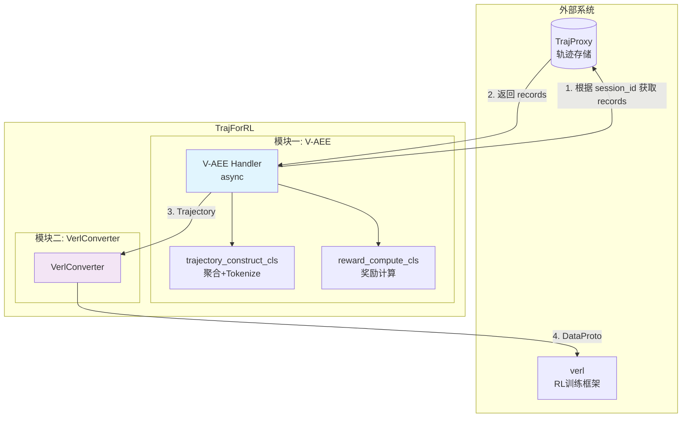
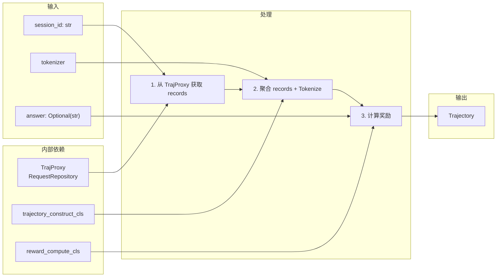
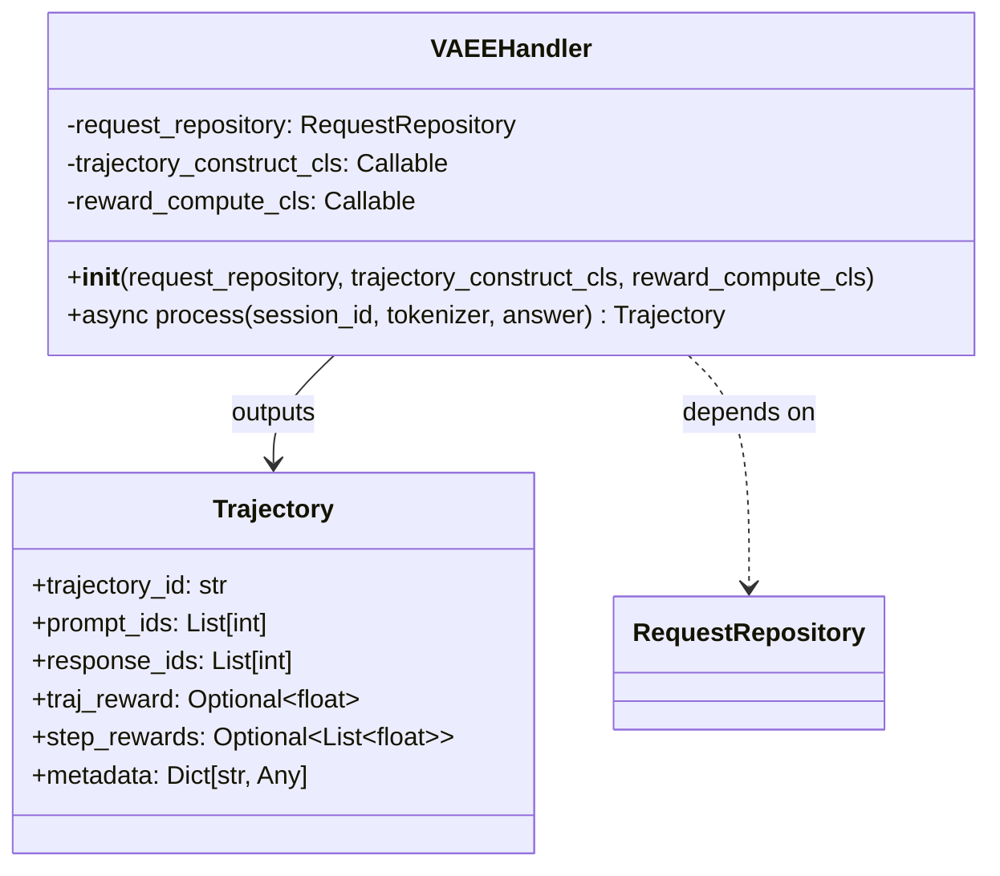
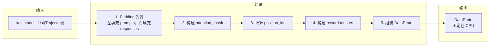
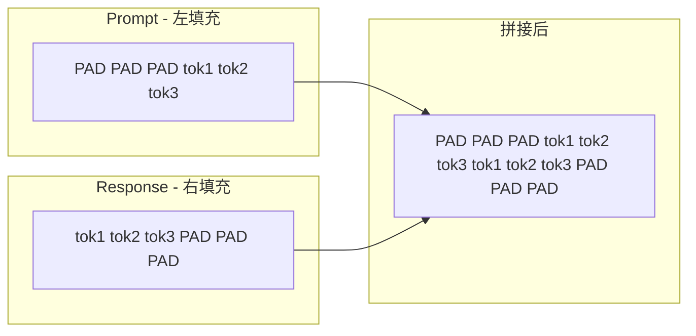
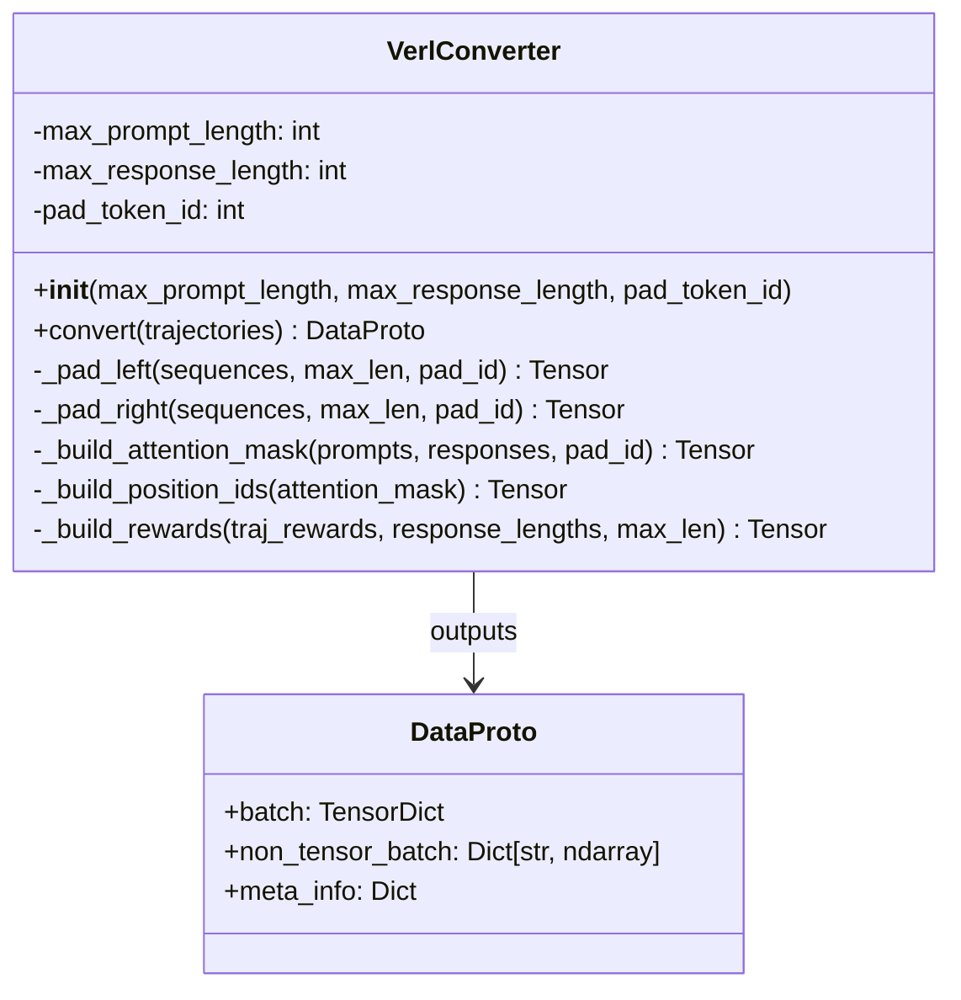

# TrajForRL 轨迹处理系统设计

## 上下文

本项目是完整 RL 系统的子模块，负责处理 Rollout 阶段的轨迹数据，转换为 verl 框架训练所需的 DataProto 格式。

**设计原则：**
1. 纯模块设计：只关注入参和出参，不需要固定 config 文件
2. 可扩展性：轨迹处理和 Reward 计算支持函数式注册
3. 格式兼容：输出严格匹配 verl DataProto 格式
4. 职责分离：Tokenize 逻辑由 trajectory_construct_cls 负责，本模块不绑定特定 tokenizer
5. 异步优先：核心接口采用 async/await，适配上层异步训练框架

**首版范围：**
- 支持纯文本轨迹处理
- 支持轨迹级奖励（traj_reward → token_level_rewards）
- 预留 token_level_scores 字段供后续扩展

---

## 整体架构



**关键设计决策：**
- Handler 内部调用 TrajProxy 获取 records，上层只需传入 session_id
- 采用异步调用方式（async/await）
- 每次处理一个 session，上层循环调用处理多个 session

---

## 模块一：VAEEHandler

### 职责

对 Agent 单个 session 的请求结果进行后处理，输出标准化的 Trajectory 对象。

**一个 session 包含多条 records**（多轮对话历史），Handler 负责聚合这些记录并计算奖励。

**Handler 内部调用 TrajProxy 获取 records**，上层只需传入 session_id。

### 数据流



### 核心类设计



### 接口定义

```python
from dataclasses import dataclass, field
from typing import List, Dict, Any, Optional, Protocol, TYPE_CHECKING
from transformers import PreTrainedTokenizer

if TYPE_CHECKING:
    from traj_proxy.store.request_repository import RequestRepository

# ============ 数据类 ============

@dataclass
class Trajectory:
    """处理后的单条轨迹
    
    Attributes:
        trajectory_id: 轨迹唯一标识（通常等于 session_id）
        prompt_ids: Prompt 部分的 token IDs
        response_ids: Response 部分的 token IDs
        traj_reward: 轨迹级别奖励（先置空，由 reward_compute_cls 填充）
        step_rewards: 预留字段，Step 级别奖励
        metadata: 元数据（可包含 model、token 统计等）
    """
    trajectory_id: str
    prompt_ids: List[int]
    response_ids: List[int]
    traj_reward: Optional[float] = None  # 先置空，后填充
    step_rewards: Optional[List[float]] = None
    metadata: Dict[str, Any] = field(default_factory=dict)


# ============ 函数签名 Protocol ============

class TrajectoryConstructCls(Protocol):
    """轨迹处理函数签名
    
    职责：
    1. 聚合/过滤/重组多条 records（多轮对话历史）
    2. 选择 Token 来源（已有的 token_ids 或使用 tokenizer 重新 tokenize）
    3. 返回 Trajectory 对象（traj_reward 置空）
    
    Args:
        session_id: 会话 ID
        records: 从 TrajProxy 获取的原始记录列表（多轮对话）
        tokenizer: Tokenizer 对象（用于 tokenize）
        answer: 可选的标准答案
    
    Returns:
        Trajectory: 轨迹对象（traj_reward 置空，由 reward_compute_cls 填充）
    """
    def __call__(
        self,
        session_id: str,
        records: List[Dict[str, Any]],
        tokenizer: PreTrainedTokenizer,
        answer: Optional[str] = None,
    ) -> Trajectory: ...


class RewardComputeCls(Protocol):
    """奖励计算函数签名
    
    Args:
        trajectory: Trajectory 对象（包含 prompt_ids、response_ids、metadata）
        answer: 标准答案
    
    Returns:
        Trajectory: 填充 traj_reward 后的 Trajectory 对象
    """
    def __call__(
        self,
        trajectory: Trajectory,
        answer: Optional[str] = None,
    ) -> Trajectory: ...


# ============ Handler 类 ============

class VAEEHandler:
    """V-AEE Handler - 单轨迹处理器
    
    处理单个 session 的多轮对话记录，输出标准化的 Trajectory 对象。
    内部调用 TrajProxy 获取 records。
    """

    def __init__(
        self,
        request_repository: "RequestRepository",
        trajectory_construct_cls: TrajectoryConstructCls,
        reward_compute_cls: RewardComputeCls,
    ):
        """
        Args:
            request_repository: TrajProxy 的 RequestRepository（用于获取 records）
            trajectory_construct_cls: 轨迹处理函数（负责聚合+tokenize）
            reward_compute_cls: 奖励计算函数
        """
        self.request_repository = request_repository
        self.trajectory_construct_cls = trajectory_construct_cls
        self.reward_compute_cls = reward_compute_cls

    async def process(
        self,
        session_id: str,
        tokenizer: PreTrainedTokenizer,
        answer: Optional[str] = None,
    ) -> Trajectory:
        """
        处理单个 session 的轨迹数据
        
        Args:
            session_id: 会话 ID
            tokenizer: Tokenizer 对象（传给 trajectory_construct_cls）
            answer: 可选的标准答案，用于奖励计算
        
        Returns:
            Trajectory: 标准化的轨迹对象
        """
        import logging
        logger = logging.getLogger(__name__)
        
        # 1. 从 TrajProxy 获取 records
        records = await self.request_repository.get_all_by_session(session_id)
        if not records:
            logger.warning(f"No records found for session {session_id}")
            raise ValueError(f"No records found for session {session_id}")

        # 2. 轨迹处理（聚合 + tokenize），返回 Trajectory（traj_reward 置空）
        trajectory = self.trajectory_construct_cls(session_id, records, tokenizer, answer)

        # 3. 验证必需字段
        if not trajectory.prompt_ids or not trajectory.response_ids:
            logger.warning(f"Empty prompt_ids or response_ids for session {session_id}")
            raise ValueError("trajectory_construct_cls must return Trajectory with non-empty prompt_ids and response_ids")

        # 4. 奖励计算，填充 traj_reward
        trajectory = self.reward_compute_cls(trajectory, answer)

        return trajectory
```

### 默认实现示例

```python
from typing import List, Dict, Any, Optional
from transformers import PreTrainedTokenizer

def default_trajectory_construct_cls(
    session_id: str,
    records: List[Dict[str, Any]],
    tokenizer: PreTrainedTokenizer,
    answer: Optional[str] = None,
) -> Trajectory:
    """默认轨迹处理器
    
    策略：取最后一条 record 作为完整轨迹。
    假设最后一条 record 已经包含完整的对话信息。
    优先使用已有的 token_ids，如果不存在则使用 tokenizer tokenize。
    
    Args:
        session_id: 会话 ID
        records: 多轮对话记录列表
        tokenizer: Tokenizer 对象
        answer: 标准答案（此默认实现不使用）
    
    Returns:
        Trajectory 对象（traj_reward 置空）
    """
    if not records:
        raise ValueError(f"No records found for session {session_id}")

    # 取最后一条记录（包含完整对话）
    last_record = records[-1]

    # 优先使用已有的 token_ids
    prompt_ids = last_record.get('token_ids')
    response_ids = last_record.get('response_ids')
    
    # 如果没有 token_ids，使用 tokenizer tokenize
    if prompt_ids is None:
        prompt_text = last_record.get('prompt_text', '')
        if prompt_text:
            prompt_ids = tokenizer.encode(prompt_text, add_special_tokens=False)
        else:
            prompt_ids = []
    
    if response_ids is None:
        response_text = last_record.get('response_text', '')
        if response_text:
            response_ids = tokenizer.encode(response_text, add_special_tokens=False)
        else:
            response_ids = []

    return Trajectory(
        trajectory_id=session_id,
        prompt_ids=prompt_ids,
        response_ids=response_ids,
        traj_reward=None,  # 先置空，由 reward_compute_cls 填充
        metadata={
            'model': last_record.get('model'),
            'prompt_tokens': last_record.get('prompt_tokens'),
            'completion_tokens': last_record.get('completion_tokens'),
        }
    )


def default_reward_compute_cls(
    trajectory: Trajectory,
    answer: Optional[str] = None,
) -> Trajectory:
    """默认奖励计算器 - 返回填充 traj_reward=0.0 的 Trajectory
    
    实际使用时应提供自定义的奖励计算函数。
    """
    trajectory.traj_reward = 0.0
    return trajectory
```

---

## 模块二：VerlConverter

### 职责

接收多条轨迹，批量转换为 verl DataProto 格式。

**配置在初始化时设定**：max_prompt_length、max_response_length、pad_token_id。

### 数据流



### Padding 策略说明



**截断策略**：
- 超出长度时静默截断
- 左填充的 prompts：从左侧截断（取最后 max_length 个 token）
- 右填充的 responses：从右侧截断（取前 max_length 个 token）

### 核心类设计



### 接口定义

```python
import logging
import torch
import numpy as np
from typing import List
from verl.protocol import DataProto
from tensordict import TensorDict

logger = logging.getLogger(__name__)


class VerlConverter:
    """VerlConverter - 批量格式转换器
    
    输出 verl DataProto 格式。
    配置在初始化时设定，输出固定在 CPU。
    """

    def __init__(
        self,
        max_prompt_length: int,
        max_response_length: int,
        pad_token_id: int,
    ):
        """
        Args:
            max_prompt_length: 最大 prompt 长度（左填充到此长度）
            max_response_length: 最大 response 长度（右填充到此长度）
            pad_token_id: Padding token ID
        """
        self.max_prompt_length = max_prompt_length
        self.max_response_length = max_response_length
        self.pad_token_id = pad_token_id

    def convert(
        self,
        trajectories: List[Trajectory],
    ) -> DataProto:
        """
        将轨迹列表转换为 verl DataProto 格式
        
        Args:
            trajectories: 轨迹列表
        
        Returns:
            DataProto: verl 兼容的数据协议对象（固定在 CPU）
        """
        if not trajectories:
            logger.warning("Empty trajectories list")
            raise ValueError("trajectories list is empty")
        
        # 1. Padding
        prompts_batch = self._pad_left(
            [t.prompt_ids for t in trajectories],
            self.max_prompt_length, self.pad_token_id
        )
        responses_batch = self._pad_right(
            [t.response_ids for t in trajectories],
            self.max_response_length, self.pad_token_id
        )

        # 2. input_ids = prompts + responses
        input_ids = torch.cat([prompts_batch, responses_batch], dim=1)

        # 3. attention_mask
        attention_mask = self._build_attention_mask(
            prompts_batch, responses_batch, self.pad_token_id
        )

        # 4. position_ids (cumsum of attention_mask)
        position_ids = self._build_position_ids(attention_mask)

        # 5. response_mask (有效 response token)
        response_mask = (responses_batch != self.pad_token_id).long()

        # 6. rewards (放在 response 最后一个有效 token 位置)
        token_level_rewards = self._build_rewards(
            [t.traj_reward for t in trajectories],
            [len(t.response_ids) for t in trajectories],
            self.max_response_length
        )
        token_level_scores = torch.zeros_like(token_level_rewards)  # 暂与 rewards 相同

        # 7. 构建 non_tensor_batch（用于 verl 训练流程）
        non_tensor_batch = {
            'uid': np.array([t.trajectory_id for t in trajectories]),
        }
        # 可选字段：ground_truth, data_source（从 metadata 获取）
        if all('ground_truth' in t.metadata for t in trajectories):
            non_tensor_batch['ground_truth'] = np.array([t.metadata['ground_truth'] for t in trajectories])
        if all('data_source' in t.metadata for t in trajectories):
            non_tensor_batch['data_source'] = np.array([t.metadata['data_source'] for t in trajectories])

        # 8. 组装 DataProto（使用 verl 原生字段命名）
        batch = TensorDict({
            'input_ids': input_ids,
            'attention_mask': attention_mask,
            'position_ids': position_ids,
            'prompts': prompts_batch,
            'responses': responses_batch,
            'response_mask': response_mask,
            'token_level_rewards': token_level_rewards,
            'token_level_scores': token_level_scores,
        }, batch_size=len(trajectories))

        return DataProto(batch=batch, non_tensor_batch=non_tensor_batch)

    def _pad_left(self, sequences: List[List[int]], max_len: int, pad_id: int) -> torch.Tensor:
        """左填充序列，超出长度时从左侧截断"""
        tensors = [torch.tensor(seq, dtype=torch.long) for seq in sequences]
        padded = []
        for t in tensors:
            if len(t) < max_len:
                pad_size = max_len - len(t)
                t = torch.cat([torch.full((pad_size,), pad_id, dtype=torch.long), t])
            else:
                t = t[-max_len:]  # 从左侧截断
            padded.append(t)
        return torch.stack(padded)

    def _pad_right(self, sequences: List[List[int]], max_len: int, pad_id: int) -> torch.Tensor:
        """右填充序列，超出长度时从右侧截断"""
        tensors = [torch.tensor(seq, dtype=torch.long) for seq in sequences]
        padded = []
        for t in tensors:
            if len(t) < max_len:
                pad_size = max_len - len(t)
                t = torch.cat([t, torch.full((pad_size,), pad_id, dtype=torch.long)])
            else:
                t = t[:max_len]  # 从右侧截断
            padded.append(t)
        return torch.stack(padded)

    def _build_attention_mask(
        self, prompts: torch.Tensor, responses: torch.Tensor, pad_id: int
    ) -> torch.Tensor:
        """构建 attention mask: 1 表示有效 token, 0 表示 padding"""
        prompts_mask = (prompts != pad_id).long()
        responses_mask = (responses != pad_id).long()
        return torch.cat([prompts_mask, responses_mask], dim=1)

    def _build_position_ids(self, attention_mask: torch.Tensor) -> torch.Tensor:
        """计算 position ids: cumsum of attention_mask - 1"""
        return (attention_mask.cumsum(dim=1) - 1) * attention_mask

    def _build_rewards(
        self, rewards: List[Optional[float]], lengths: List[int], max_len: int
    ) -> torch.Tensor:
        """构建奖励 tensor，放在 response 最后一个有效 token 位置"""
        batch_size = len(rewards)
        reward_tensor = torch.zeros(batch_size, max_len, dtype=torch.float32)
        for i, (reward, length) in enumerate(zip(rewards, lengths)):
            if reward is not None and length > 0 and length <= max_len:
                reward_tensor[i, length - 1] = reward
        return reward_tensor
```

---

## DataProto 字段映射

**代码来源**: `verl/protocol.py:328-339`, `verl/trainer/ppo/core_algos.py:214`, `verl/trainer/ppo/ray_trainer.py:240`

### Tensor 字段（batch）

| 字段名 | 类型 | 形状 | 说明 |
|--------|------|------|------|
| `input_ids` | LongTensor | [bs, prompt_len + response_len] | 完整输入序列 |
| `attention_mask` | LongTensor | [bs, seq_len] | 1=有效, 0=padding |
| `position_ids` | LongTensor | [bs, seq_len] | 位置编码 |
| `prompts` | LongTensor | [bs, max_prompt_length] | Prompt（左填充） |
| `responses` | LongTensor | [bs, max_response_length] | Response（右填充） |
| `response_mask` | LongTensor | [bs, max_response_length] | 有效 response token |
| `token_level_rewards` | FloatTensor | [bs, max_response_length] | 奖励在最后有效位 |
| `token_level_scores` | FloatTensor | [bs, max_response_length] | 暂与 rewards 相同 |

### Non-Tensor 字段（non_tensor_batch）

| 字段名 | 类型 | 说明 |
|--------|------|------|
| `uid` | ndarray[str] | 样本唯一标识（用于 GRPO advantage 计算） |
| `ground_truth` | ndarray[object] | 标准答案（可选，用于 reward 计算） |
| `data_source` | ndarray[str] | 数据来源（可选） |

**Non-Tensor 字段代码来源**: `verl/trainer/ppo/ray_trainer.py:255-256`, `verl/docs/preparation/reward_function.rst:29-33`

---

## TrajProxy Record 结构

从 TrajProxy 获取的单条记录（`RequestRecord`）包含以下字段。

**代码来源**: `TrajProxy/traj_proxy/store/models.py:30-86`

### 标识字段

| 字段 | 类型 | 说明 |
|------|------|------|
| `unique_id` | str | 全局唯一标识 |
| `request_id` | str | 请求 ID |
| `session_id` | str | 会话 ID（多轮对话共用） |
| `run_id` | Optional[str] | 运行 ID（区分不同训练运行） |

### 模型信息

| 字段 | 类型 | 说明 |
|------|------|------|
| `model` | str | 模型名称 |
| `tokenizer_path` | Optional[str] | Tokenizer 路径 |

### 请求数据（三阶段）

| 字段 | 类型 | 说明 |
|------|------|------|
| `messages` | List[Any] | 消息列表（OpenAI 格式） |
| `raw_request` | Optional[Any] | 阶段1: 完整 OpenAI 请求 |
| `raw_response` | Optional[Any] | 阶段1: 完整 OpenAI 响应 |
| `text_request` | Optional[Any] | 阶段2: 文本推理请求 |
| `text_response` | Optional[Any] | 阶段2: 文本推理响应 |
| `token_request` | Optional[Any] | 阶段3: Token 推理请求 |
| `token_response` | Optional[Any] | 阶段3: Token 推理响应 |

### Token 数据

| 字段 | 类型 | 说明 |
|------|------|------|
| `prompt_text` | Optional[str] | Prompt 文本 |
| `token_ids` | Optional[List[int]] | Prompt Token IDs |
| `response_text` | Optional[str] | 响应文本 |
| `response_ids` | Optional[List[int]] | Response Token IDs |
| `full_conversation_text` | Optional[str] | 完整对话文本 |
| `full_conversation_token_ids` | Optional[List[int]] | 完整对话 Token IDs |

### 统计信息

| 字段 | 类型 | 说明 |
|------|------|------|
| `prompt_tokens` | Optional[int] | Prompt Token 数量 |
| `completion_tokens` | Optional[int] | Completion Token 数量 |
| `total_tokens` | Optional[int] | 总 Token 数量 |
| `cache_hit_tokens` | int | 缓存命中 Token 数量 |
| `processing_duration_ms` | Optional[float] | 处理耗时（毫秒） |

### 时间信息

| 字段 | 类型 | 说明 |
|------|------|------|
| `start_time` | Optional[datetime] | 请求开始时间 |
| `end_time` | Optional[datetime] | 请求结束时间 |
| `created_at` | Optional[datetime] | 记录创建时间 |

### 错误信息

| 字段 | 类型 | 说明 |
|------|------|------|
| `error` | Optional[str] | 错误信息 |
| `error_traceback` | Optional[str] | 错误堆栈 |

### 归档信息

| 字段 | 类型 | 说明 |
|------|------|------|
| `archive_location` | Optional[str] | 归档位置（NULL=活跃） |
| `archived_at` | Optional[datetime] | 归档时间 |

**records 关系说明：**
- 一个 session 包含多条 records，代表多轮对话历史
- 每条 record 是一次模型推理请求的结果
- 最后一条 record 通常包含完整的对话信息

---

## 项目目录结构

```
TrajForRL/
├── traj_for_rl/
│   ├── __init__.py
│   ├── vaee_handler.py      # V-AEE Handler
│   ├── verl_converter.py    # VerlConverter
│   ├── dataclasses.py       # Trajectory
│   └── processors/
│       ├── __init__.py
│       └── defaults.py      # default_trajectory_construct_cls, default_reward_compute_cls
├── tests/
│   ├── __init__.py
│   ├── test_vaee_handler.py
│   └── test_verl_converter.py
├── docs/
│   └── DESIGN.md
├── CLAUDE.md
└── pyproject.toml
```

---

## 设计决策记录

| 决策项 | 选择 | 原因 |
|--------|------|------|
| Tokenize 位置 | trajectory_construct_cls 负责 | 不绑定特定 tokenizer，更灵活 |
| 多模态支持 | 首版不支持 | 简化范围，后续扩展 |
| 奖励字段命名 | 使用 verl 原生命名 | token_level_rewards, token_level_scores，直接与 verl 训练流程对接 |
| 注册机制 | 函数式注册 | 简单直接，无需继承 |
| 多 Record 处理 | 可配置 | 通过 processor 控制聚合策略 |
| Non-Tensor 字段 | 支持 uid, ground_truth, data_source | verl 训练流程必需（GRPO advantage 计算需要 uid） |
| 奖励来源 | 模块内计算 | 由 reward_compute_cls 实现，返回填充后的 Trajectory |
| 模块封装 | 仅独立模块 | 上层直接调用，不需要 Facade |
| 调用方式 | 异步调用 (async/await) | 适配上层异步训练框架 |
| 数据获取 | Handler 内部调用 TrajProxy | 上层只需传入 session_id |
| 批量处理 | 每次处理一个 session | Handler 处理单个，上层循环调用 |
| tokenizer 传入 | 直接传入 tokenizer 对象 | 在 process() 时传入 |
| Trajectory 归属 | 先置空后填充 | trajectory_construct_cls 返回 Trajectory（traj_reward=None），reward_compute_cls 填充 |
| processed 命名 | 改为 trajectory | 命名更清晰 |
| 返回值类型 | 返回 Trajectory | trajectory_construct_cls 返回 Trajectory |
| 长度配置 | 初始化时配置 | max_prompt_length、max_response_length 在 Converter 初始化时设定 |
| 截断策略 | 静默截断 | 参考 rllm 和 verl 的实现 |
| Device | 固定 CPU | 输出 Tensor 固定在 CPU，上层决定是否转移到 GPU |
| 日志框架 | 使用 logging | 使用 Python 标准库 logging |
| VAEEHandler 类名 | V-AEE Handler | 模块一的核心处理器类名 |
| VerlConverter 类名 | VerlConverter | 模块二的转换器类名 |

---

## 验证方案

### 单元测试

```python
# tests/test_vaee_handler.py
import pytest
from unittest.mock import AsyncMock, MagicMock
from transformers import AutoTokenizer

@pytest.mark.asyncio
async def test_handler_with_default_processor():
    """测试默认处理器"""
    # Mock RequestRepository
    mock_repo = AsyncMock()
    mock_repo.get_all_by_session.return_value = [
        {'token_ids': [1,2,3], 'response_ids': [4,5,6], 'model': 'test'}
    ]
    
    # Mock tokenizer
    mock_tokenizer = MagicMock()
    
    handler = VAEEHandler(
        request_repository=mock_repo,
        trajectory_construct_cls=default_trajectory_construct_cls,
        reward_compute_cls=default_reward_compute_cls,
    )
    traj = await handler.process('test_session', mock_tokenizer)
    assert traj.prompt_ids == [1, 2, 3]
    assert traj.response_ids == [4, 5, 6]
    assert traj.traj_reward == 0.0  # 由 reward_compute_cls 填充

@pytest.mark.asyncio
async def test_handler_with_custom_processor():
    """测试自定义处理器"""
    def custom_construct_cls(session_id, records, tokenizer, answer):
        # 聚合所有 records
        all_prompt_ids = []
        all_response_ids = []
        for r in records:
            all_prompt_ids.extend(r.get('token_ids', []))
            all_response_ids.extend(r.get('response_ids', []))
        return Trajectory(
            trajectory_id=session_id,
            prompt_ids=all_prompt_ids,
            response_ids=all_response_ids,
        )
    
    mock_repo = AsyncMock()
    mock_repo.get_all_by_session.return_value = [
        {'token_ids': [1,2,3], 'response_ids': [4,5,6]},
        {'token_ids': [7,8], 'response_ids': [9,10]},
    ]
    
    mock_tokenizer = MagicMock()
    
    handler = VAEEHandler(
        request_repository=mock_repo,
        trajectory_construct_cls=custom_construct_cls,
        reward_compute_cls=default_reward_compute_cls,
    )
    traj = await handler.process('test_session', mock_tokenizer)
    assert traj.prompt_ids == [1, 2, 3, 7, 8]
    assert traj.response_ids == [4, 5, 6, 9, 10]


# tests/test_verl_converter.py
def test_converter_basic():
    """测试基本转换"""
    converter = VerlConverter(
        max_prompt_length=10,
        max_response_length=10,
        pad_token_id=0,
    )
    
    trajectories = [
        Trajectory(
            trajectory_id='test_1',
            prompt_ids=[1, 2, 3],
            response_ids=[4, 5, 6],
            traj_reward=1.0,
        ),
        Trajectory(
            trajectory_id='test_2',
            prompt_ids=[7, 8],
            response_ids=[9, 10, 11, 12],
            traj_reward=0.5,
        ),
    ]
    
    data_proto = converter.convert(trajectories)
    
    assert data_proto.batch['input_ids'].shape == (2, 20)
    assert data_proto.batch['prompts'].shape == (2, 10)
    assert data_proto.batch['responses'].shape == (2, 10)
    # 验证 verl 原生字段命名
    assert 'token_level_rewards' in data_proto.batch
    assert 'token_level_scores' in data_proto.batch
    # 验证 non_tensor_batch
    assert 'uid' in data_proto.non_tensor_batch
    assert data_proto.non_tensor_batch['uid'][0] == 'test_1'

def test_converter_truncation():
    """测试截断"""
    converter = VerlConverter(
        max_prompt_length=5,
        max_response_length=5,
        pad_token_id=0,
    )
    
    trajectories = [
        Trajectory(
            trajectory_id='test_1',
            prompt_ids=[1, 2, 3, 4, 5, 6, 7, 8],  # 超过 max_prompt_length
            response_ids=[9, 10, 11, 12, 13, 14, 15],  # 超过 max_response_length
            traj_reward=1.0,
        ),
    ]
    
    data_proto = converter.convert(trajectories)
    
    # 左截断：取最后 5 个
    assert data_proto.batch['prompts'][0].tolist() == [4, 5, 6, 7, 8]
    # 右截断：取前 5 个
    assert data_proto.batch['responses'][0].tolist() == [9, 10, 11, 12, 13]
```

### 集成验证

- 使用 TrajProxy 真实数据验证端到端流程
- 对比 verl rollout 输出确保格式兼容
- 验证 DataProto 可被 verl 训练流程正常消费

### 参考代码仓库路径

TrajProxy: /Users/liujiang/Workspace/Code/TrajProxy 参考输入数据格式
Verl: /Users/liujiang/Workspace/Code/verl-0.7.0 参考输出数据格式
Rllm: /Users/liujiang/Workspace/Code/rllm 参考数据转换过程
